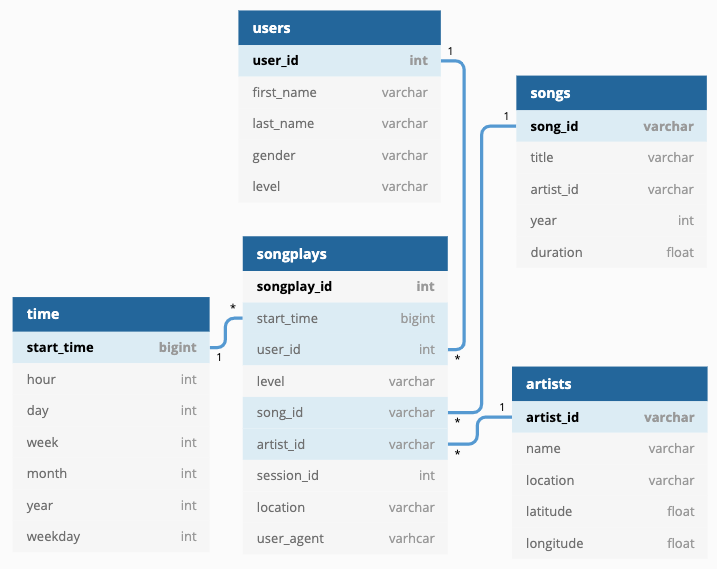

# Introduction

A startup called Sparkify wants to analyze the data they have been collecting on songs and user activity on their new music streaming app. The analytics team is particularly interested in understanding what songs users are listening to. The aim of this project is to create a Postgres database schema and ETL pipeline to optimize queries for song play analysis.

# Project Description

In this project, I modelled data with Postgres and built an ETL pipeline using Python using the `psycopg2` wrapper. On the database side of things, I defined fact and dimension tables using the Star schema as the data provided from Sparkify is best suited for this kind of layout. Using these tables, I created an ETL pipeline that would transfer data from the JSON data files located in two local directories that contains song data and log data and created these tables using this scheme in Postgres using Python and SQL.

# Schema for Song Play Analysis

## Fact Table

`songplays` records the log data from users that is associated with song plays i.e. records with page `NextSong`.

- _Columns_: `songplay_id, start_time, user_id, level, song_id, artist_id, session_id, location, user_agent`

## Dimension Tables

We have the following dimension tables:

- `users`: Are the users in the streaming app.
  - _Columns_: `user_id, first_name, last_name, gender, level`.
- `songs`: Are the songs in the music database.
  - _Columns_: `song_id, title, artist_id, year, duration`
- `artists`: Are the artists in music database.
  - _Columns_: `artist_id, name, location, latitude, longitude`
- `time`: Are the timestamps of logs in songplays decomposed into specific units of time.
  - _Columns_: `start_time, hour, day, week, month, year, weekday`

## Entity Relationship Diagram of the Proposed Schema

# Project Design

The database design is optimized due to the minimum number of tables needed to not only represent the data, but to take advantage of as few table joins as possible to gather the information we need to perform our analysis. The ETL process is designed to allow reading in the JSON files provided by Sparkify and to parse the necessary information to populate the aforementioned tables.

# Steps

## 1. Run Database Script

We must first initialize our database and tables. Running `python create_tables.py` in the terminal allows this to happen.

## 2. Run Jupyter Notebooks

The `etl.ipynb` notebook file provides us an easy way to verify that our creation and insertion logic for populating our tables functions correctly. This notebook is provided for testing a single combination of log and song files. Once we run through this notebook, the `test.ipynb` notebook file checks if we have populated our tables properly.

## 3. Run Main Processing Script

Once we have completed the above steps, we must run the `etl.py` file in the terminal: `python etl.py`. This file was created by examining the relevant statements in the `etl.ipynb` test notebook and copying those over into the `etl.py`. Docstrings for each function have also been added. The function examines all JSON files for the logs and songs and populate our tables with all of this information.

# Summary of Relevant Files

- `sql_queries.py`: Contains strings that contain SQL queries for dropping, creating and inserting into the tables we need for this project.
- `create_tables.py`: Drops any of the tables in the project should they exist and recreates them. We initially initialize our tables from scratch.
- `etl.ipynb`: Test notebook that processes a single combination of JSON files from the song and logs data to ensure insertion and creation of the tables is correct.
- `test.ipynb`: Tests to see if we have populated our tables correctly.
- `etl.py`: The final processing script to process all JSON files for the song and logs data captured.
- `README.md`: This file.
- `erd.png`: Entity Relationship Diagram of the proposed schema
- `data`: The directory that contains sample JSON files that we will need to
  process through our ETL pipeline.
